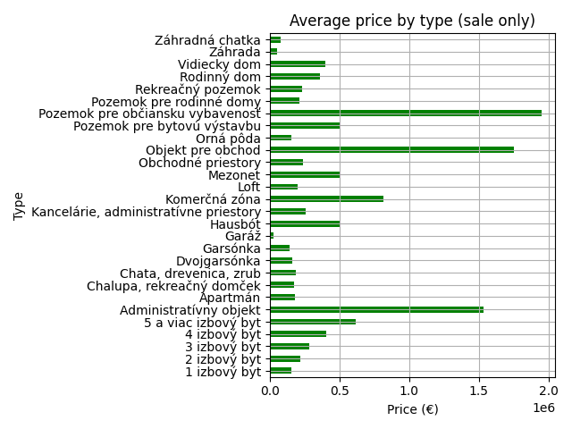

A Python-based web scraping project that collects real estate listings from Slovak property websites. The data includes price, location, and area of flats, which are saved in CSV format. Basic analysis and visualizations (average prices, price per square meter, etc.) are included using pandas and matplotlib. Built with BeautifulSoup and requests.
# 🏠 Real Estate Data Scraper & Analyzer

This project collects and analyzes real estate listings from Slovakia using web scraping techniques. It focuses on extracting price, location, and property type information, and visualizes key trends such as average prices per city or property type.

## 🚀 Features

- Scrapes real estate listing data (price, city, district, type, listing type)
- Saves collected data into CSV format
- Performs data analysis using `pandas` and `numpy`
- Creates visualizations with `matplotlib`

## 🧾 Sample Dataset
price,city,district,type,listing_type
225900,Bratislava-Staré Mesto,Bratislava,2 izbový byt,sale
215000,Bratislava-Staré Mesto,Bratislava,2 izbový byt,sale
145000,Zvolen,Zvolen,3 izbový byt,sale
1050,Košice-Lorinčík,Košice,2 izbový byt,rent
245000,Miloslavov,Senec,5 a viac izbový byt,sale
185000,Košice-Staré Mesto,Košice,2 izbový byt,sale

## 📊 Example Visualizations

